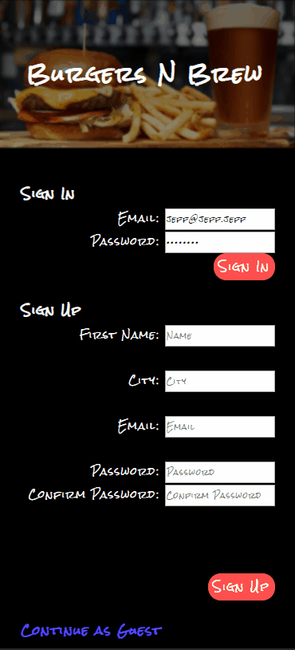

# burgers-n-brew
A dynamic mobile-first web application for hungry people who want to find deals on a classic combo - burgers and beer.

## Live Website
Try the application live at [https://bnb.jeff-j.me](https://bnb.jeff-j.me)

## Technologies Used
- React.js
- SASS
- Node.js
- Express.js
- Passport.js
- React Router
- PostgreSQL
- Bootstrap 4
- AWS EC2
- bcrypt 4
- Webpack 4

## Features
- User can view local restaurants
- User can view details of specific restaurants
- User can enter a location via text input
- User can allow geolocation for their current location
- User can create an account
- User can set a default location to their account
- User can post a suggested burger
- User can post a suggested brew
- User can view top 3 suggestions of a restaurant

## Preview


## Development

### System Requirements
- Node.js 10 or higher
- NPM 6 or higher
- PostgreSQL 10 or higher
- Express.js 4 or higher

### Getting Started
1. Clone the repository.

    ```shell
    git clone https://github.com/jeff-jones2020/burgers-n-brew
    cd burgers-n-brew
    ```

2. Install all dependencies with NPM.

    ```shell
    npm install
    ```

3. Import the example database to PostgreSQL.

    ```shell
    npm run db:import
    ```

4. Start the project. Once started you can view the application by opening http://localhost:3000 in your browser.

    ```shell
    npm run dev
    ```
